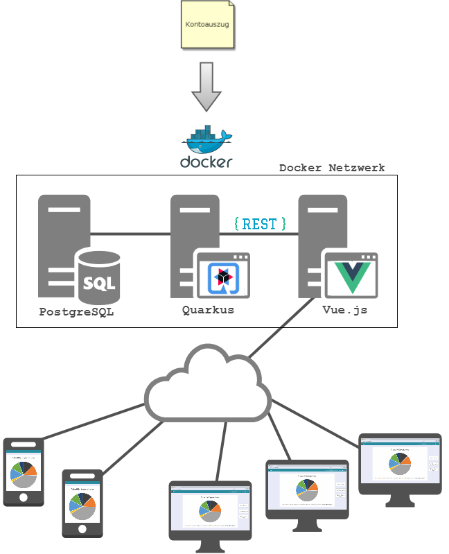

# IncomeExpensesAccounting - IEA 

## :bookmark_tabs: Übersicht
- [Was ist IEA?](#money_with_wings-was-ist-iea)
- [Systemarchitektur](#statue_of_liberty-systemarchitektur)
- [Funktionsweise](#chart_with_upwards_trend-funktionsweise)
- [Konfiguration](#wrench-konfiguration)
  - [Inbetriebnahme des JEE-Servers](#computer-inbetriebnahme-des-jee-servers)
  - [Inbetriebnahme des Webservers](#computer-inbetriebnahme-des-webservers)
- [Technologien](#microscope-technologien)
- [Das Team](#surfer-das-team)
- [Lizenz](#closed_lock_with_key-lizenz)

## :money_with_wings: Was ist IEA?
IncomeExpensesAccounting (IEA) ist ein Einnahmen & Ausgabenprogramm, welches einen Überblick über die gesamten Finanzen schafft.

## :statue_of_liberty: Systemarchitektur


## :chart_with_upwards_trend: Funktionsweise


### :newspaper: Erklärung
Die Zahlungen werden von der Bank als csv-File zur Verfügung gestellt und müssen auf Buchungen aufgeteilt werden. Dabei werden zwei Fälle unterschieden: 
Fall A: Eine Zahlung kann automatisiert (ev. auch manuell) auf ein Konto gebucht werden (sachliche Abgrenzung), sowie dem richtigen Jahr zugeordnet werden.  
Fall B: Manche Zahlungen betreffen aber nicht nur das Jahr der Zahlung, sondern werden über mehrere Jahre hinweg abgeschrieben: PCs im Wert von 30.000 EUR werden bspw. drei Jahre genutzt und für diesen Zeitraum abgeschrieben, d.h. es entsteht ein Aufwand von 10.000 EUR pro Jahr. 
Damit eine solche Abschreibung möglich ist gibt es Kontenarten wie Aufwands- und Ertragskonten. In die Aufwandskonten werden die negativen Beträge gebucht, die positiven Beträge werden ins Ertragskonto gebucht.
Bestandskonten werden wir in weiterer Folge auch noch brauchen um die Anschaffungskosten der Investitionsgüter zu verbuchen, diese sind jedoch momentan noch unwichtig.

## :wrench: Konfiguration

### :computer: Inbetriebnahme des JEE-Servers

#### DB starten

```
cd db/
/opt/derbydb/bin/startNetworkServer -noSecurityManager
```

#### Wildfly konfigurieren

- In der Toolbar auf "Add Configuration..." klicken
- JBoss-server local hinzufügen
- Darauf achten, dass der wildfly server mit der ip `localhost:8085` konfiguriert ist

#### JEE-Server starten bzw. stoppen

- Starten: in der Toolbar auf "Run" klicken
- Stoppen: in der Toolbar auf "Stop" klicken


### :computer: Inbetriebnahme des Webservers

- Webserver projekt in der Webstorm IDE öffnen
- Ins root-verzeichnis wechseln
```
cd wwwroot/
```
- Pakete installieren
```
npm i
```

#### Webserver testen

- Ins root-verzeichnis wechseln
```
cd wwwroot/
```
- Polymer starten
```
npm start
```

#### Nginx-server starten

- Polymer build aufrufen
```
polymer build
```
- Docker starten

```
docker-compose up
```

#### Seite im Browser öffnen

- Im Browser `localhost:80` eingeben

#### Nginx-server stoppen

- Docker herunterfahren 

```
docker-compose down
```

## :microscope: Technologien
- JakartaEE
- Docker
- Polymer

## :surfer: Das Team
- Michael Frech
- Julian Nobis

## :closed_lock_with_key: Lizenz

[MIT License](LICENSE)

Copyright (c) 2018 IEA

Permission is hereby granted, free of charge, to any person obtaining a copy
of this software and associated documentation files (the "Software"), to deal
in the Software without restriction, including without limitation the rights
to use, copy, modify, merge, publish, distribute, sublicense, and/or sell
copies of the Software, and to permit persons to whom the Software is
furnished to do so, subject to the following conditions:

The above copyright notice and this permission notice shall be included in all
copies or substantial portions of the Software.

THE SOFTWARE IS PROVIDED "AS IS", WITHOUT WARRANTY OF ANY KIND, EXPRESS OR
IMPLIED, INCLUDING BUT NOT LIMITED TO THE WARRANTIES OF MERCHANTABILITY,
FITNESS FOR A PARTICULAR PURPOSE AND NONINFRINGEMENT. IN NO EVENT SHALL THE
AUTHORS OR COPYRIGHT HOLDERS BE LIABLE FOR ANY CLAIM, DAMAGES OR OTHER
LIABILITY, WHETHER IN AN ACTION OF CONTRACT, TORT OR OTHERWISE, ARISING FROM,
OUT OF OR IN CONNECTION WITH THE SOFTWARE OR THE USE OR OTHER DEALINGS IN THE
SOFTWARE.
